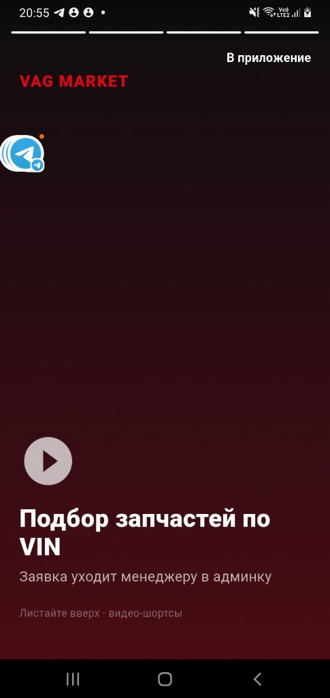
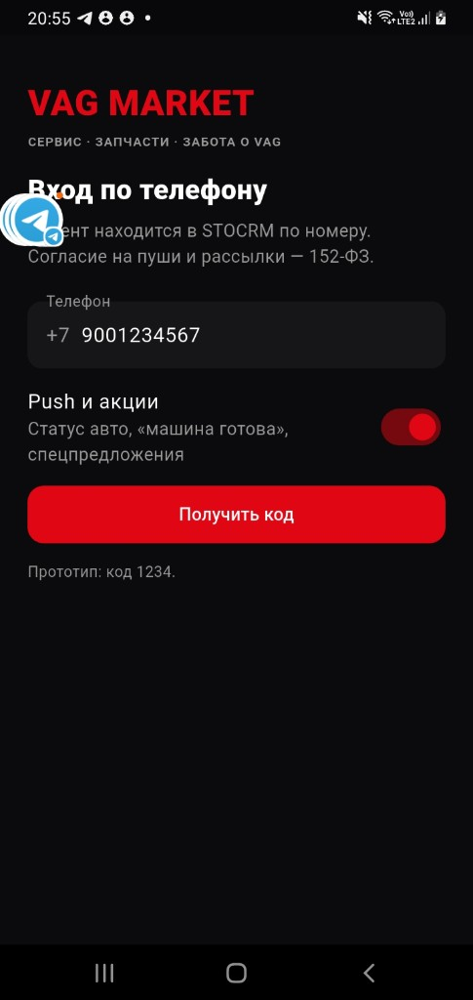
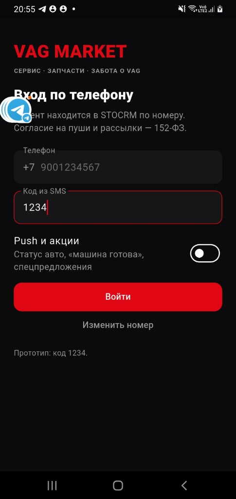
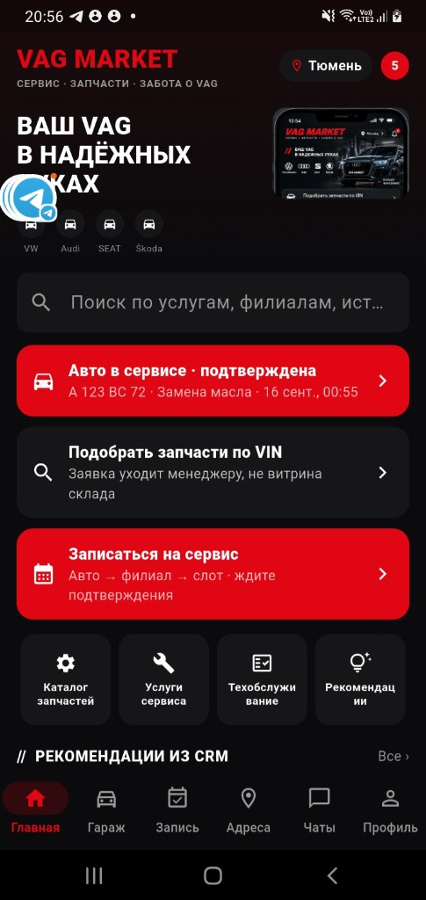
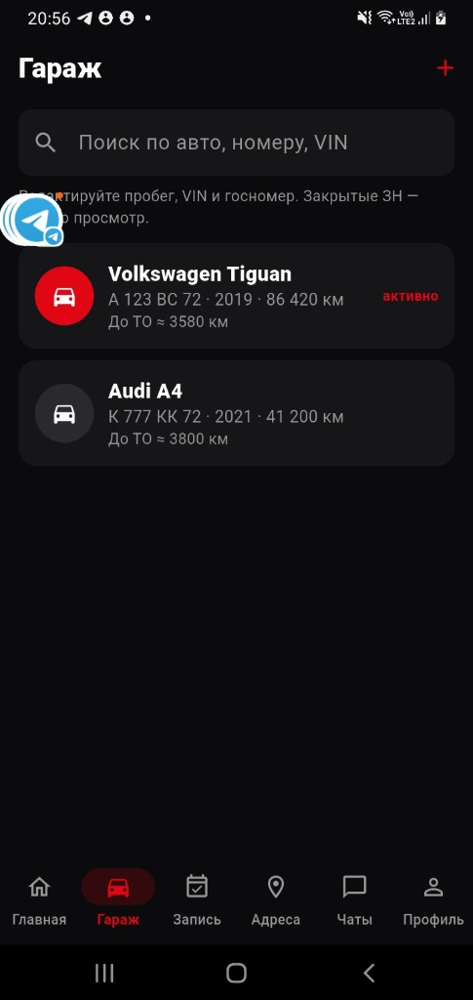
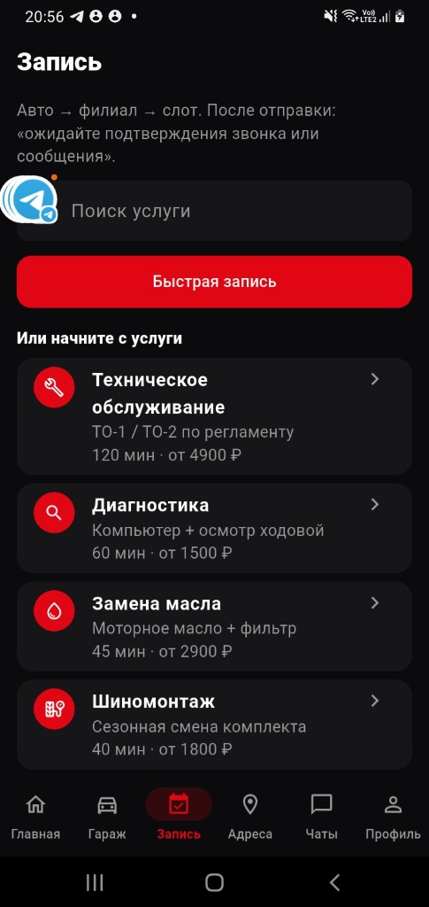
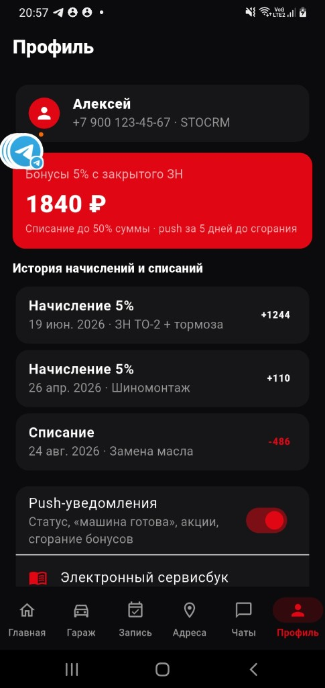
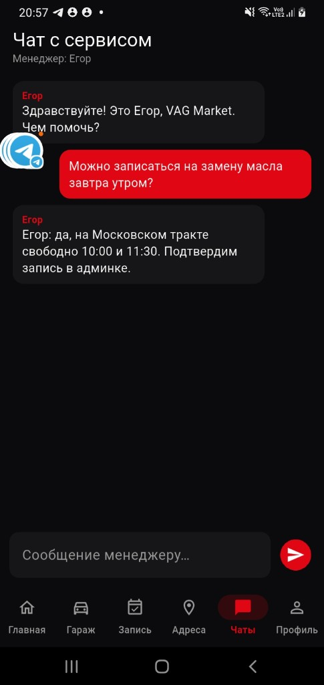
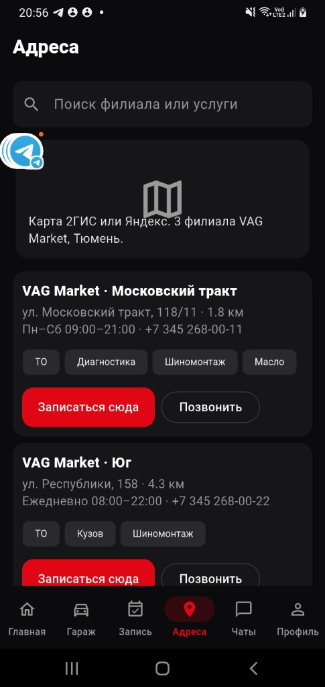

# Приложение автосервиса VAG Market + STOCRM

Брендированное клиентское приложение iOS/Android для **ИП Гоман П.И.** (`vagmarket72.ru`): запись, история работ, статусы, push, чат с админкой, бонусы 5%. Учёт в **STOCRM**.

ТЗ v1.1 (11.09.2026) — по итогам встречи: [tz.html](tz.html).

| | Цена | Срок |
|--|------|------|
| Недели 1–3 | 175 000 ₽ | 2.5–3 нед. |
| Неделя 4 (рассылки, виджет, сторы) | +85 000 ₽ | +1–1.5 нед. |
| Пакет | **260 000 ₽** | ~4 нед. |

## Документы

- [docs/index.html](docs/index.html) — хаб: код, гайды, QA
- [docs/DEVELOPMENT.md](docs/DEVELOPMENT.md) — что сделано, карта API, следующий этап
- [docs/manager-guide.html](docs/manager-guide.html) — менеджеру (приём заявок в CRM)
- [docs/user-guide.html](docs/user-guide.html) — клиенту
- [docs/qa.html](docs/qa.html) — чеклист тестирования (Pass/Fail как kitchenai)
- [tz.html](tz.html) — техническое задание
- [kp.html](kp.html) — коммерческое предложение
- [dogovor.html](dogovor.html) — договор (ИП Гоман П.И.)
- [plan.html](plan.html) — план на 4 недели
- [kp-telegram.txt](kp-telegram.txt) — текст для Telegram / MAX

https://app72.ru/projects/stocrm-mobile-app/kp.html

## APK прототипа

- [APK 32-bit](https://drive.google.com/file/d/1akSQ_s5xSq5N9td4e2oz4JWI2opjJg7Z/view?usp=sharing) — Galaxy A10 и старше
- [APK 64-bit](https://drive.google.com/file/d/16zUkimWyne_W9q33xZV8sn9JR1OXyfRW/view?usp=sharing) — новые телефоны

Вход прототипа: любой номер, код **1234**. Боевой тест CRM: контакт в кабинете, тот же код (см. [гайд менеджеру](docs/manager-guide.html)).

Скрины с телефона: [`screenshots/`](screenshots/).











## Прототип Flutter

Прототип Flutter: [`prototype/`](prototype/). BFF: [`server/`](server/) — SID только в `server/.env`.

```bash
cd server && python3 -m venv .venv && source .venv/bin/activate && pip install -r requirements.txt
cp .env.example .env   # домен и SID
uvicorn app.main:app --reload --port 8080
python probe.py        # карта методов Public API
```

```bash
cd prototype
flutter pub get
flutter run -d chrome          # или iOS/Android симулятор
```

Экраны: вход (OTP `1234`), главная, гараж, мастер записи, филиалы, визиты, статус ремонта, чат, профиль/бонусы.
