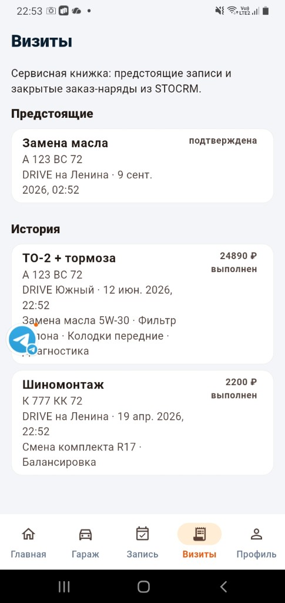
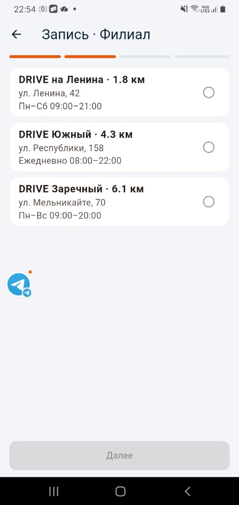
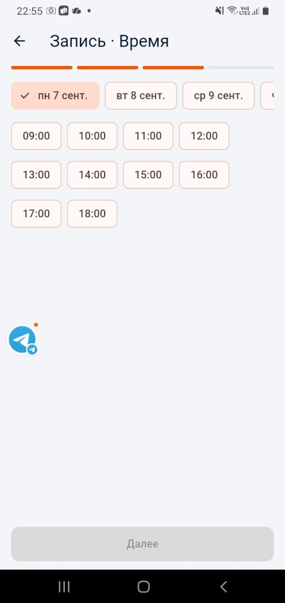
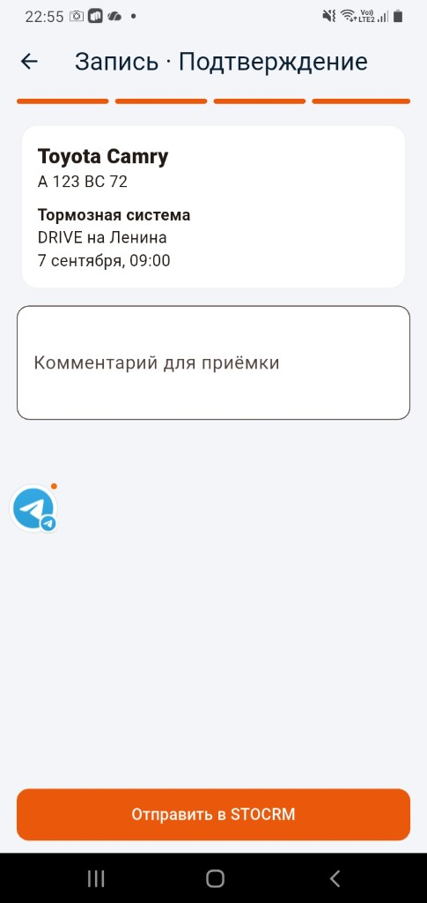
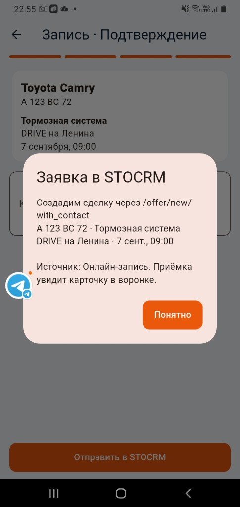

# Приложение автосервиса + STOCRM (как FIT SERVICE)

Брендированное клиентское приложение iOS/Android: гараж, онлайн-запись, история обслуживания. Заявки создаются в **STOCRM** заказчика.

| Этап | Цена | Срок |
|------|------|------|
| 1. MVP + STOCRM | 175 000 ₽ | 2.5–3 нед. |
| 2. Пакет «как FIT» | +85 000 ₽ | +1–1.5 нед. |
| Пакет разработки | **260 000 ₽** | ~4 нед. |
| Apple на год (подписка) | 48 000 ₽ | продление со 2-го года — неизвестно |
| Google Play | 2 500 ₽ + $30 | продление через год — неизвестно |
| Публикация GP (тест 14 дн.) + App Store + RuStore | 30 000 ₽ | |
| Хостинг | 700–1 000 ₽/мес | |
| **К выходу в сторы, 1-й год** | **340 500 ₽ + $30** | + хостинг помесячно |

## Документы

- [tz.html](tz.html) — техническое задание
- [kp.html](kp.html) — коммерческое предложение
- [kp-telegram.txt](kp-telegram.txt) — текст для Telegram / MAX

https://app72.ru/projects/stocrm-mobile-app/kp.html

## APK прототипа

- [APK 32-bit](https://drive.google.com/file/d/1akSQ_s5xSq5N9td4e2oz4JWI2opjJg7Z/view?usp=sharing) — Galaxy A10 и старше
- [APK 64-bit](https://drive.google.com/file/d/16zUkimWyne_W9q33xZV8sn9JR1OXyfRW/view?usp=sharing) — новые телефоны

Вход: любой номер, код **1234**.

Скрины с телефона: [`screenshots/`](screenshots/).










## Прототип Flutter

Папка [`prototype/`](prototype/) — кликабельный UI (mock-данные, без SID):

```bash
cd prototype
flutter pub get
flutter run -d chrome          # или iOS/Android симулятор
```

Экраны: вход (OTP `1234`), главная, гараж, мастер записи, филиалы, визиты, статус ремонта, чат, профиль/бонусы.
